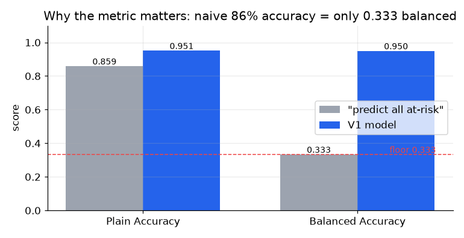
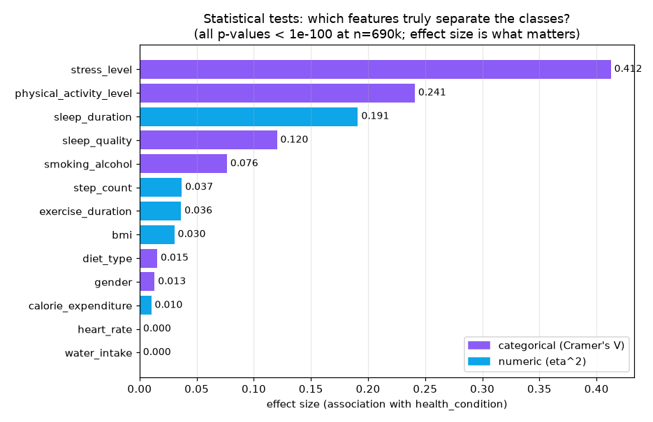
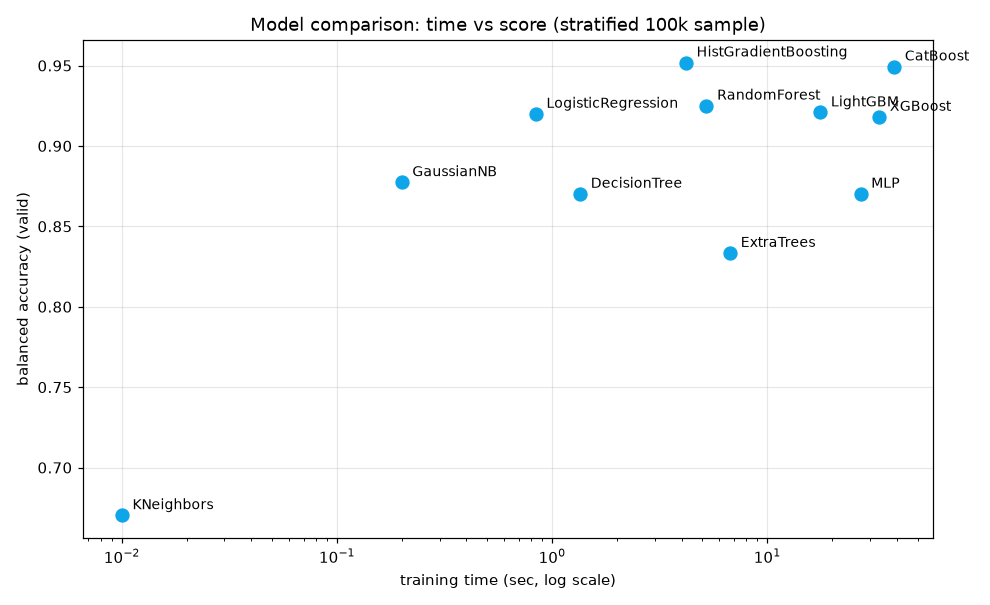
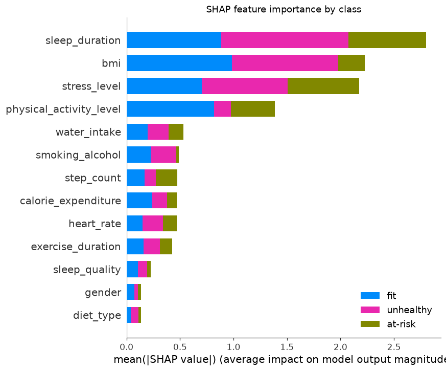
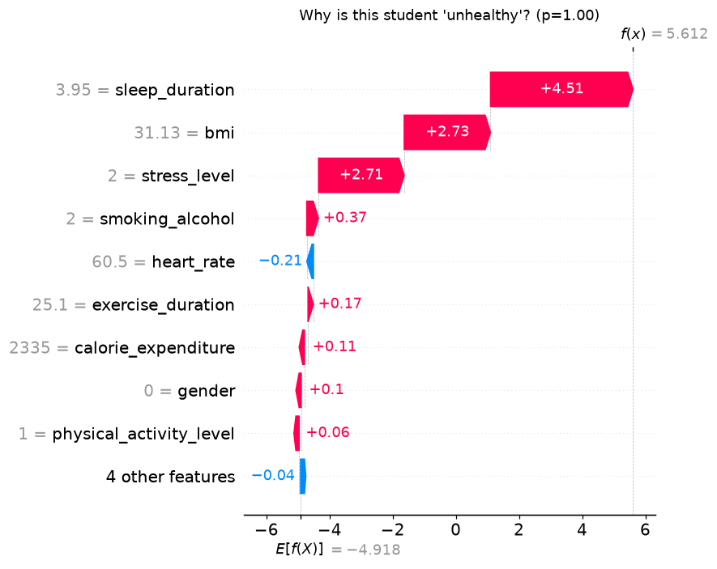
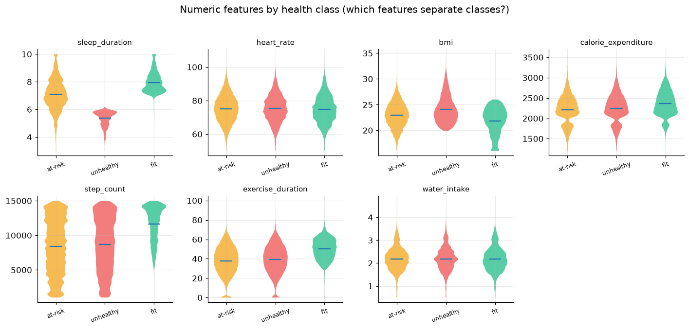

# 🩺 학생 건강 위험 조기 예측 — Kaggle Playground S6E7

> 생활습관 데이터 13개로 학생 건강상태를 3등급(at-risk / unhealthy / fit)으로 분류.
> **Public LB 0.94952** (Balanced Accuracy) · 로컬 CV와 갭 **0.0001** · 11개 모델 체계 비교

| | |
|---|---|
| 대회 | [Playground Series S6E7 — Predicting Student Health Risk](https://www.kaggle.com/competitions/playground-series-s6e7) |
| 과제 | 3-클래스 다중분류 (극단 불균형 86 : 8 : 6) |
| 지표 | **Balanced Accuracy** (클래스별 recall 평균) |
| 데이터 | train 690,088행 · test 295,753행 · 피처 13개 (수치 7 + 범주 6) |
| 기간 | 2026-07 (팀 미니프로젝트, 발표 07-15) |

---

## 📌 핵심 결과

### 1. "정확도 86%가 0점대"인 지표의 함정을 정면 공략
전부 다수 클래스(at-risk)로 찍으면 **정확도 0.86, balanced accuracy 0.333**.
→ 소수 클래스(unhealthy 8%·fit 6%) recall이 점수를 지배 → `sample_weight='balanced'` 가중학습 + 층화 CV로 설계.



### 2. 건강등급은 사실상 3요인이 결정 — 3가지 독립 방법으로 삼각검증
| 방법 | 결과 |
|---|---|
| 통계 검정 (χ²·ANOVA 효과크기) | stress_level V=0.41 · sleep_duration η²=0.19 · activity V=0.24 ≫ 나머지 |
| 모델 feature importance (gain) | 동일 상위 3개가 압도적 |
| 커뮤니티의 원본데이터 역공학 | 깊이 4 결정트리 규칙에 정확히 이 3개만 등장 |



### 3. 11개 모델 동일조건 비교 — HistGradientBoosting이 최고점·최단시간
층화추출 10만행, 동일 전처리·가중치·split, 학습시간 측정 포함.

| 순위 | 모델 | Balanced Acc | 학습시간 |
|---|---|---|---|
| 🥇 | HistGradientBoosting | **0.95183** | **4.2s** |
| 🥈 | CatBoost | 0.94934 | 38.9s |
| 🥉 | RandomForest | 0.92500 | 5.2s |
| 4~11 | LightGBM · LogReg · XGBoost · NB · MLP · DT · ET · KNN | 0.92~0.67 | — |



### 4. 검증을 신뢰할 수 있게 만든 뒤 리더보드에 올렸다
- StratifiedKFold(5) OOF로 제출 지표와 **동일한** balanced accuracy 산출
- V1 제출: **로컬 CV 0.94962 → Public LB 0.94952 (갭 0.0001)** → 이후 실험은 LB 소모 없이 CV로만 판단

### 5. SHAP으로 모델 설명 — "왜 이 학생이 위험한가"까지
클래스별 기여 요인(beeswarm)과 개인 단위 설명(waterfall). 수면 3.95h + 고스트레스 학생을 모델이 unhealthy(p=1.00)로 판정한 근거가 그대로 읽힌다 — 조기경보 서비스에서 상담사에게 제공할 설명 그 자체.

| 클래스별 중요도 | 개인 설명 (waterfall) |
|---|---|
|  |  |

---

## 🔍 EDA 하이라이트

수면시간 하나로도 클래스가 갈린다 — unhealthy는 5.5h 부근, fit은 8h 부근:



전체 EDA(차트 7종 + 해설)는 **[EDA.html](EDA.html)** 참고. 통계검정 상세는 `oof/eda_stats_*.csv`.

## 🏗️ 아키텍처

```
ColumnTransformer
 ├─ 수치 7: SimpleImputer(median, add_indicator) → StandardScaler
 └─ 범주 6: SimpleImputer('missing')             → OneHotEncoder
        ↓
 분류기 (sklearn API) + sample_weight='balanced' + eval_set early stopping
        ↓
 StratifiedKFold(5) OOF → balanced accuracy → (결정보정은 OOF에서만 튜닝)
```

## 📁 구조

```
├── EDA.html            # 시각 EDA 리포트 (차트 내장, 브라우저로 열기)
├── PLANNING.md         # 기획서: SCQA·과정도식·액션플랜·한계점
├── src/
│   ├── config.py       # 경로·시드·클래스 정의
│   ├── features.py     # 로드·dtype·타겟 인코딩
│   ├── cv.py           # 층화 K-fold OOF 하네스 (+다중시드)
│   ├── train_lgbm.py   # V1 베이스라인 (LB 0.94952)
│   ├── model_zoo.py    # 11개 모델 동일조건 비교 (시간측정)
│   ├── eda_charts.py   # EDA 차트 7종 생성
│   ├── eda_stats.py    # χ²·ANOVA·효과크기 검정
│   └── optimize.py     # balanced accuracy 결정규칙 보정 (OOF 기반)
├── assets/             # 차트 PNG + 통계 결과
├── oof/                # OOF/test 확률(npy, git 제외) + 결과 CSV
└── data/               # Kaggle 데이터 (git 제외, 다운로드 안내 포함)
```

## 🚀 재현

```bash
pip install -U scikit-learn lightgbm xgboost catboost matplotlib
kaggle competitions download -c playground-series-s6e7 -p data && cd data && tar -xf *.zip && cd ..
python src/eda_charts.py      # EDA 차트
python src/eda_stats.py       # 통계 검정
python src/model_zoo.py       # 11개 모델 비교 (샘플 10만)
python src/train_lgbm.py      # V1 베이스라인 + 제출파일
```

## 🧭 실험 로그 (상세: EXPERIMENTS.md)

| N | 실험 | CV (bal_acc) | Public LB | 판정 |
|---|---|---|---|---|
| N1 | LGBM 5-fold, class_weight balanced | 0.94962 | 0.94952 | 기준점 (CV↔LB 갭 0.0001) |
| - | 11개 모델 동일조건 비교 (층화 10만행) | HistGB 0.95183 | - | 주력 모델 선정 |
| N2 | **HistGB + exact-value TE ×5시드** | **0.95051** | **0.94982** | ✅ 현 베스트 (TE가 +0.0008) |
| N4 | NN 주기임베딩 MLP (T4 GPU, 7분) | 0.94883 | 0.94906 | 상보성 실험용 |
| - | 기각 6종: 원본증강·소프트임퓨테이션·LGBM보팅·NN블렌드·3종가중치·세그먼트보정 | - | - | 전부 중첩검증 +0.0005 미달 — "모든 모델이 같은 규칙에 수렴" 실증 |
| N5 | HGB+TE 10fold×7seed (진행중) | - | - | 분산 축소판 |

**방법론 원칙**: 채택 기준 = 중첩검증 정직 이득 +0.0005 이상 · 모든 튜닝은 OOF 내부 · public LB(20%) 불신, CV 신뢰

## ⚠️ 한계

- 합성데이터 특성상 점수 천장(~0.952) 존재, 실세계 일반화 검증은 아님
- MLP·KNN은 sample_weight 미지원 → 비교표에 보정 없음 명시
- 상관≠인과: 개입(수면 늘리기 등) 효과는 별도 검증 필요
